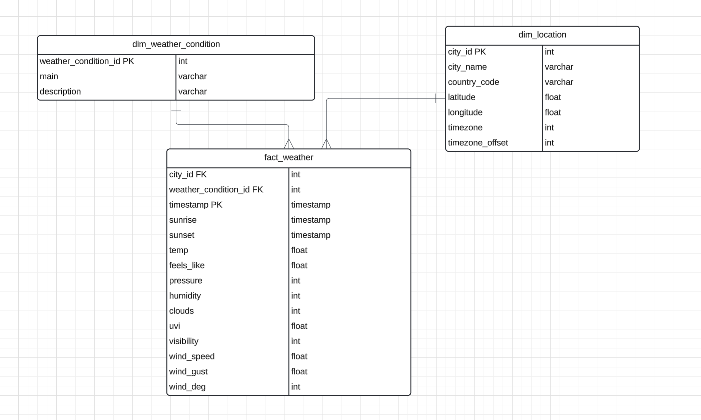

# Weather Data Pipeline with Airflow and PostgreSQL

This project builds a data pipeline using Apache Airflow to ingest, process, and load weather data from the [OpenWeather API](https://openweathermap.org/api) into a PostgreSQL database hosted in Docker. The pipeline automates the extraction of weather data, processes the data, and stores it in a well-structured PostgreSQL database for further analysis or reporting.

## Project Structure

```bash
weather-data-pipeline/
│
├── dags/
│   └── weather_data_pipeline.py        # Airflow DAG definition
    │
    ├── src/
    │   ├── config.py                       # Configuration file for DB connection details
    │   ├── fetch_weather_data.py           # Script to fetch data from OpenWeather API
    │   ├── loading/
    │   │   ├── insert_dim_condition.py     # Script to insert data into dim_weather_condition
│   │       └── insert_dim_location.py      # Script to insert data into dim_location
│   └── process_and_load_weather_data.py # Script to process and load data into fact_weather
│
├── docker-compose.yaml                 # Docker Compose file to set up PostgreSQL in Docker
└── README.md                           # Project description file
```

# Features

- **API Integration**: Weather data is fetched from the OpenWeather API for various cities.
- **Data Ingestion**: Apache Airflow orchestrates the data extraction and processing.
- **Data Processing**: Extracted data is processed and transformed into a structured format.
- **Data Storage**: Processed data is loaded into a PostgreSQL database with fact and dimension tables (in a star schema).
- **Dockerized Setup**: PostgreSQL is hosted on Docker for easy deployment and development.

# Data Flow

- **Ingestion**: The DAG starts by calling the OpenWeather API to fetch current weather data for specific cities.
- **Processing**: The data is cleaned, and key fields like city, weather conditions, and weather measurements are extracted.
- **Loading**: Data is inserted into dimension tables (location and weather condition) and fact table (weather measurements) in the PostgreSQL database.

# Schema



# Airflow DAG

The DAG defines the following tasks:

- **Create Tables**: Tasks to create dimension and fact tables in PostgreSQL.
- **Fetch Weather Data**: Calls the OpenWeather API to retrieve the latest weather data for configured cities.
- **Process Weather Data**: Cleans and processes the data, preparing it for insertion into the database.
  Insert Data: Inserts data into the dimension and fact tables in the PostgreSQL database.

# Setup Instructions

## Prerequisites

Before you can run this project, ensure you have the following installed on your machine and Docker is running:

- [Docker](https://docs.docker.com/get-docker/)
- [Docker Compose](https://docs.docker.com/compose/install/)

## Installation

### Clone the repository:

```bash
git clone https://github.com/lephuocloc1729/weather-data-pipeline
cd weather-data-pipeline
```

## Running the Project

To start the project using Docker Compose, run the following command:

```bash
docker compose up airflow-init
```

```bash
docker compose up -d
```

## Accessing Airflow UI

You can access Airflow UI at [localhost:8080](http://localhost:8080)
